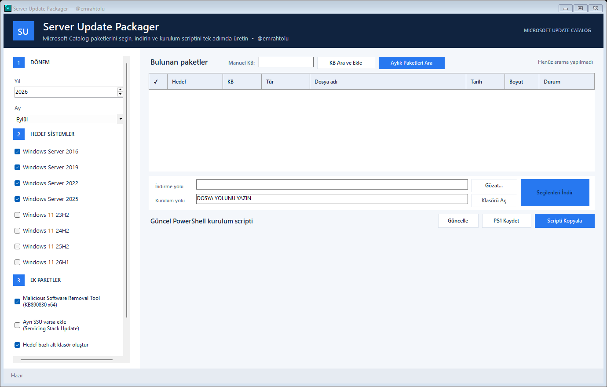

# Server Update Packager

`Server-Update-Packager-v2.exe`, Microsoft Update Catalog üzerindeki x64 güncelleme paketlerini bulmayı, indirmeyi ve hedef sisteme göre PowerShell kurulum listesi oluşturmayı kolaylaştıran taşınabilir bir Windows aracıdır.

Geliştiren ve proje sahibi: [@emrahtolu](https://github.com/emrahtolu)



## Özellikler

- Windows Server 2016, 2019, 2022 ve 2025 için aylık Cumulative Update (CU) arama
- Windows 11 23H2, 24H2, 25H2 ve 26H1 için aylık CU arama
- Seçime bağlı ayrı Servicing Stack Update (SSU) arama ve CU'dan önce kurulum sırası
- Seçime bağlı Malicious Software Removal Tool (KB890830)
- Preview, .NET, Dynamic Update, Safe OS ve Setup Dynamic sonuçlarını aylık aramada ayıklama
- Server 2025 ile desteklenen Windows 11 sürümlerinde checkpoint MSU dosyalarını doğru sıraya yerleştirme
- Girilen belirli bir KB numarası için x64 Catalog sonuçlarını bulup seçerek indirme
- Hedef işletim sistemine göre klasörleme ve güncel PowerShell kurulum betiği üretme
- İndirilen her dosyanın SHA-256 değerini içeren CSV manifest
- Kurulum gerektirmeyen tek EXE ve Windows sistem proxy desteği

> Manuel KB aramasındaki paketler hedef işletim sistemiyle otomatik ve kesin biçimde eşleştirilemediği için güvenlik amacıyla oluşturulan PowerShell kurulum betiğine eklenmez. Dosyalar `Manual KB` klasörüne indirilir ve manifestte listelenir.

## SSU davranışı

Microsoft, Şubat 2021'den itibaren desteklenen yeni Windows sürümlerinde SSU'yu çoğunlukla LCU ile tek pakette birleştirir. Bu nedenle **Ayrı SSU varsa ekle** seçildiğinde bazı hedeflerde ayrı sonuç bulunmaması normaldir. Araç yalnız Catalog'da ilgili ay ve hedef için gerçekten ayrı bir x64 SSU yayımlandıysa onu ekler.

Kaynak: [Microsoft Learn — Servicing stack updates](https://learn.microsoft.com/en-us/windows/deployment/update/servicing-stack-updates)

## Kullanım

1. Yıl ve ayı seçin.
2. Windows Server ve/veya Windows 11 hedeflerini işaretleyin.
3. İsterseniz MSRT ve ayrı SSU seçeneklerini etkinleştirin.
4. **Aylık Paketleri Ara** düğmesine basın.
5. Listeden indirilecek dosyaları seçin, indirme klasörünü ve PowerShell içindeki kurulum yolunu girin.
6. **Seçilenleri İndir** düğmesine basın.

Tek bir KB için üst bölümdeki **Manuel KB** alanına `KB5039212` gibi bir değer yazıp **KB Ara ve Ekle** düğmesini kullanın.

## Ağ ve güvenlik duvarı gereksinimleri

Araç yalnız dışarı yönlü bağlantı kurar; gelen bağlantı, P2P veya Delivery Optimization portu kullanmaz.

| Amaç | FQDN | Protokol/port |
|---|---|---|
| Catalog arama ve indirme bağlantısını çözme | `catalog.update.microsoft.com`, `www.catalog.update.microsoft.com` | TCP 443, TLS 1.2 |
| Güncelleme içeriği/CDN | `*.dl.delivery.mp.microsoft.com` | TCP 443; yönlendirmeye göre TCP 80 de kullanılabilir |
| Eski veya alternatif Catalog indirme adresleri | `download.windowsupdate.com`, `*.download.windowsupdate.com` | TCP 80 ve 443 |
| Daha geniş Microsoft Catalog kuralı tercih edilirse | `*.update.microsoft.com` | TCP 80 ve 443 |

Kurumsal proxy üzerinde HTTP `GET` ve `POST`, yönlendirmeler ve birkaç GB büyüklüğündeki dosyalar izinli olmalıdır. IP adresi yerine FQDN kuralı kullanın; Microsoft CDN adresleri değişebilir. İşletim sisteminiz sertifika iptal/CTL kontrolü yapıyorsa kurum politikanıza göre `ctldl.windowsupdate.com`, `crl.microsoft.com` ve ilgili OCSP adreslerine de izin gerekebilir.

Microsoft kaynakları: [Update Catalog indirme bilgisi](https://www.catalog.update.microsoft.com/DownloadInformation.aspx), [Windows bağlantı uç noktaları](https://learn.microsoft.com/en-us/windows/privacy/manage-windows-11-endpoints)

## Derleme

Gereksinimler:

- Windows
- .NET SDK
- .NET Framework 4.8 Developer Pack veya Visual Studio 2022 Build Tools

PowerShell'de depo kökünden:

```powershell
.\build.ps1
```

Çıktı `artifacts\Server-Update-Packager-v2.exe` olur. Derleme sonunda öz test çalıştırılır ve SHA-256 değeri yazdırılır. Dosya adı bilerek sabittir; yeni derlemelerde GitHub bağlantısının bozulmaması için değiştirilmemelidir.

## Gizlilik

- Kodda sabit kurum adı, domain, kullanıcı profili, paylaşım yolu veya kimlik bilgisi yoktur.
- Varsayılan PowerShell paket yolu `DOSYA YOLUNU YAZIN` değeridir.
- Araç telemetri göndermez ve kullanıcı kimlik bilgilerini dosyaya kaydetmez.
- Ağ trafiği Microsoft Update Catalog ile Catalog'un döndürdüğü Microsoft indirme adresleriyle sınırlıdır.

## Katkı

Katkı kuralları için [CONTRIBUTING.md](CONTRIBUTING.md) dosyasına bakın. İndirilen Microsoft paketlerini veya kurum içi bilgi içeren log/ekran görüntülerini repoya eklemeyin.
